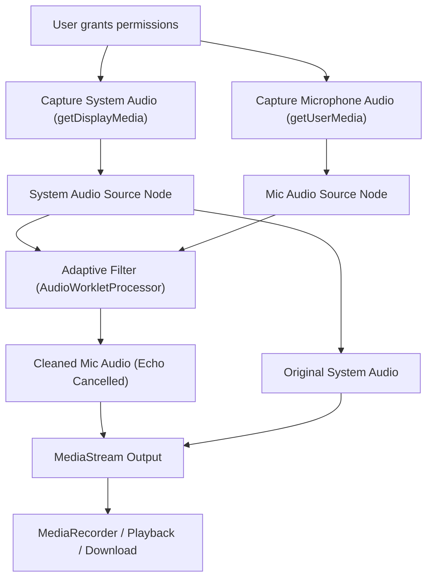

# Parallel Audio Stream Separation (Browser)

## Problem Statement

Simultaneously capture system audio (via screen capture) and microphone audio in a Chrome browser. The challenge is that when both are captured, audio bleed/echo occurs — microphone often picks up the system audio. This project demonstrates a solution to separate these streams cleanly using real-time signal processing.

## Features

- Capture system audio and microphone audio in parallel.
- Real-time echo cancellation and stream separation using an adaptive filter (LMS).
- Browser-based, no server required.

## System Design Diagram



## How It Works

1. **Capture Streams:**
   - Microphone: `navigator.mediaDevices.getUserMedia({ audio: true })`
   - System Audio: `navigator.mediaDevices.getDisplayMedia({ audio: true })`

2. **Signal Processing:**
   - Use the Web Audio API to process both streams.
   - Apply an adaptive filter (LMS) in an AudioWorkletProcessor to subtract the system audio from the microphone input, reducing echo/bleed.

3. **Output:**
   - Cleaned microphone and system audio streams, available for playback or further processing.

## Getting Started

### Prerequisites

- Chrome browser (latest version recommended)
- Node.js and pnpm (for local development)

### Installation

```bash
pnpm install
pnpm dev
```

### Usage

1. Open the app in Chrome.
2. Click "Start Capture" to grant permissions for microphone and screen (with audio).
3. The app will process and separate the audio streams in real-time.

## File Structure

- `src/app/components/Recorder.tsx` — Main React component for audio capture and processing.
- `src/app/components/AdaptiveFilterProcessor.js` — AudioWorkletProcessor for adaptive filtering (LMS echo cancellation).
- `src/app/components/reencodeVideo.ts` — (Optional) For video/audio re-encoding.
- `src/app/page.tsx` — Entry point for the app.

## Signal Processing Details

- The core technique is adaptive filtering: the system audio is used as a reference to subtract from the microphone input, minimizing overlap.
- This is similar to echo cancellation in teleconferencing systems.
- Implemented in a real-time AudioWorkletProcessor for low-latency processing.

## References

- [Web Audio API](https://developer.mozilla.org/en-US/docs/Web/API/Web_Audio_API)
- [Adaptive Filtering (LMS)](https://en.wikipedia.org/wiki/Least_mean_squares_filter)
- [Chrome Media Capture](https://developer.chrome.com/docs/web-platform/screen-capture/)

## License

MIT
